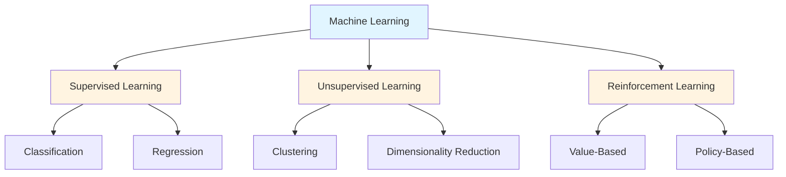
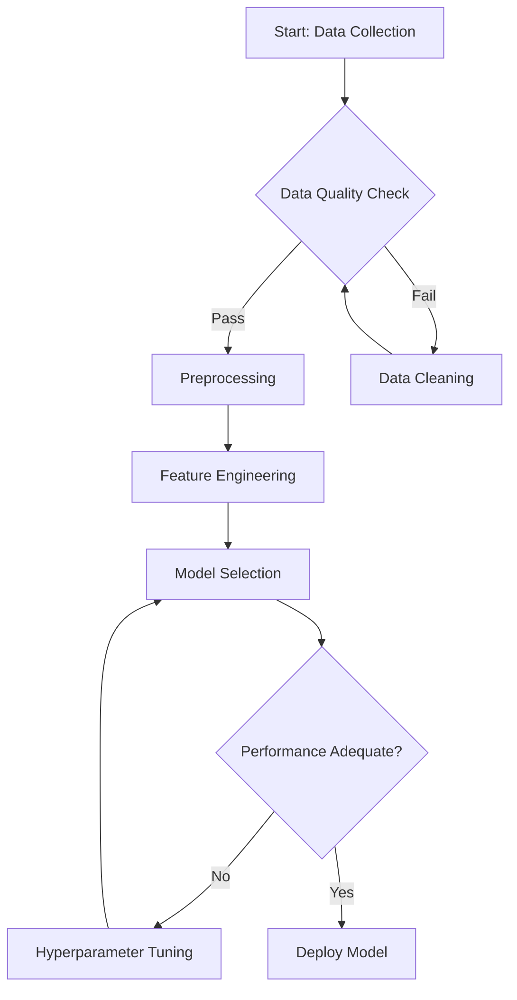
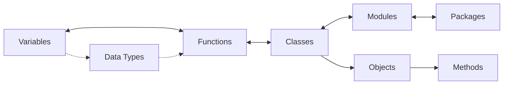
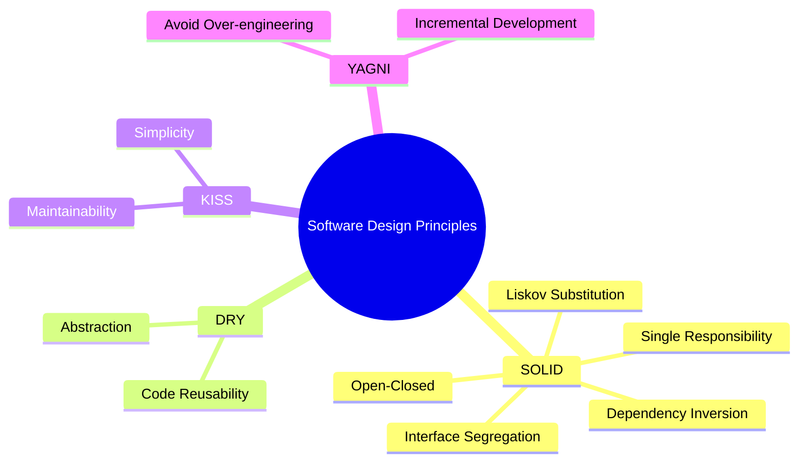

# Notes Generator - Technical Reference

## Advanced Bloom's Taxonomy Implementation

### Cognitive Level Selection Algorithms

The notes-generator employs adaptive algorithms to determine optimal Bloom's Taxonomy level inclusion based on topic characteristics.

#### Topic Classification Matrix

| Topic Category | Primary Levels | Secondary Levels | Emphasis |
|----------------|----------------|------------------|----------|
| Factual/Historical | Remember, Understand | Analyze | Retention |
| Procedural/Technical | Apply, Analyze | Understand, Create | Implementation |
| Conceptual/Theoretical | Understand, Analyze, Evaluate | Remember, Create | Comprehension |
| Creative/Design | Create, Evaluate | Apply, Analyze | Innovation |
| Systems/Architecture | Analyze, Evaluate | Understand, Apply | Integration |

#### Selection Heuristics

**Rule 1: Minimum Viable Coverage**
- Always include at least 3 taxonomy levels
- Never omit Understand level (foundational for all learning)

**Rule 2: Progressive Complexity**
- Lower levels (Remember, Understand) establish foundation
- Middle levels (Apply, Analyze) build competence
- Upper levels (Evaluate, Create) develop mastery

**Rule 3: Domain Alignment**
- STEM topics: Emphasize Apply, Analyze (70% of content)
- Humanities: Emphasize Understand, Evaluate (70% of content)
- Arts: Emphasize Create, Evaluate (70% of content)
- Business: Balance across Apply, Analyze, Evaluate (even distribution)

### Content Depth Calibration

#### Moderate Depth Specification (5-7 Points per Level)

Each point should constitute a **complete learning unit**:

**Minimum Point Structure**:
- Declarative statement or concept introduction
- Supporting explanation or context (1-2 sentences)
- Example or illustration (where applicable)

**Example - Remember Level Point**:
```markdown
- **Neural Network**: A computational model inspired by biological neural networks,
  consisting of interconnected nodes (neurons) organized in layers. The basic
  architecture includes an input layer, one or more hidden layers, and an output layer.
  Example: A feedforward neural network with 784 input neurons (28×28 image),
  128 hidden neurons, and 10 output neurons (digit classification).
```

**Example - Apply Level Point**:
```markdown
- **Training a Simple Neural Network**: Initialize weights randomly, forward propagate
  input through layers using activation functions (e.g., ReLU), compute loss using
  appropriate function (cross-entropy for classification), backpropagate error gradients,
  and update weights using optimizer (SGD, Adam). Repeat for multiple epochs until
  convergence. Implementation typically uses frameworks like PyTorch or TensorFlow:
  `model.fit(X_train, y_train, epochs=10, batch_size=32)`.
```

#### Depth Adjustment Triggers

**Reduce to 5 points per level when**:
- Topic is narrow or highly specialized
- Source material is limited
- Introductory/overview notes requested
- Time constraints specified by user

**Expand to 7 points per level when**:
- Topic is broad with multiple dimensions
- Abundant source material available
- Comprehensive study notes requested
- Advanced/graduate level content

### Visual Diagram Design Patterns

#### Diagram Type Selection Decision Tree

```
Topic Analysis
├─ Hierarchical structure? (categories, classifications)
│  └─ Use: graph TD (top-down tree)
│
├─ Sequential process? (steps, procedures, workflows)
│  └─ Use: flowchart LR/TD
│
├─ Interconnected concepts? (relationships, networks)
│  └─ Use: graph LR with bidirectional edges
│
├─ Multiple dimensions? (aspects, facets)
│  └─ Use: mindmap
│
└─ Comparative structure? (alternatives, options)
   └─ Use: graph with parallel branches
```

#### Advanced Mermaid Patterns

**Pattern 1: Multi-Level Hierarchy**


**Pattern 2: Process Flow with Decision Points**


**Pattern 3: Relationship Network**


**Pattern 4: Conceptual Mind Map**


### Practice Question Engineering

#### Bloom-Aligned Question Stems

**Remember Level**:
- Define, List, Name, Identify, Label, State, Match, Recall, Recognize, Select

**Understand Level**:
- Explain, Describe, Summarize, Paraphrase, Interpret, Classify, Compare, Contrast

**Apply Level**:
- Apply, Demonstrate, Use, Solve, Execute, Implement, Compute, Calculate, Modify

**Analyze Level**:
- Analyze, Differentiate, Organize, Deconstruct, Compare, Examine, Categorize, Distinguish

**Evaluate Level**:
- Evaluate, Critique, Judge, Justify, Assess, Defend, Argue, Recommend, Prioritize

**Create Level**:
- Design, Construct, Create, Develop, Formulate, Compose, Plan, Produce, Synthesize

#### Question Complexity Gradation

**Simple Questions** (1-step cognitive process):
```
Remember: "What is the definition of polymorphism?"
Understand: "Explain the difference between class and object."
```

**Moderate Questions** (2-3 step cognitive process):
```
Apply: "Given this class structure, how would you implement inheritance to avoid code duplication?"
Analyze: "Compare the time complexity of bubble sort and quicksort. Why does one outperform the other?"
```

**Complex Questions** (4+ step cognitive process):
```
Evaluate: "Assess whether microservices or monolithic architecture would be more appropriate
           for a startup with 5 developers building an e-commerce platform. Justify your decision
           considering scalability, team size, and time-to-market."

Create: "Design a caching strategy for a high-traffic news website that balances freshness of
         content with server load. Specify cache invalidation rules, TTL values, and explain
         your design choices."
```

#### Answer Provision Strategy

**Default Behavior**: Questions without answers (encourages active learning)

**Optional Enhancement**: Provide answers in collapsible sections
```markdown
<details>
<summary>Answer</summary>

[Detailed answer with explanation]

**Key Points**:
- Point 1
- Point 2

**Explanation**: [Why this answer is correct, common misconceptions]
</details>
```

### Multi-Source Synthesis Strategies

#### Research Protocol for Topic Investigation

**Phase 1: Broad Search (2-3 queries)**
```
Query 1: "[topic] tutorial" or "[topic] introduction"
Query 2: "[topic] comprehensive guide" or "[topic] fundamentals"
Query 3: "[topic] best practices" or "[topic] advanced concepts"
```

**Phase 2: Source Quality Filtering**

Prioritize sources in order:
1. Official documentation (for technical topics)
2. Academic institutions (.edu domains)
3. Reputable educational platforms (Khan Academy, Coursera, edX)
4. Established technical publishers (O'Reilly, Manning, Packt)
5. High-quality community resources (well-maintained wikis, GitHub docs)

Avoid:
- Content farms with shallow information
- Outdated resources (>5 years for technology topics)
- Sources without author credentials or citations
- Promotional/sales-oriented content

**Phase 3: Content Extraction and Synthesis**

For each source:
1. Extract unique concepts not covered in previous sources
2. Identify consensus definitions and explanations
3. Note conflicting perspectives (include multiple viewpoints in notes)
4. Collect concrete examples and use cases
5. Record citations for reference section

**Phase 4: Integration**

Synthesize extracted content:
- Use consensus explanations for core concepts
- Include multiple perspectives for controversial topics
- Distribute examples across appropriate Bloom levels
- Attribute specific claims or specialized information to sources

### Domain-Specific Templates

#### STEM Template Enhancements

**Additional Sections**:
```markdown
## Mathematical Foundations
[Relevant equations, formulas, theorems]

## Algorithmic Complexity
[Time/space complexity analysis where applicable]

## Experimental Validation
[Key experiments, empirical results, benchmarks]
```

**Diagram Preferences**:
- Flowcharts for algorithms
- Hierarchical graphs for taxonomies
- Network diagrams for system architectures

#### Humanities Template Enhancements

**Additional Sections**:
```markdown
## Historical Context
[Development of ideas over time, key figures]

## Theoretical Frameworks
[Major schools of thought, paradigms]

## Critical Perspectives
[Diverse viewpoints, debates, critiques]
```

**Diagram Preferences**:
- Timelines for historical development
- Mind maps for theoretical relationships
- Comparative tables for different perspectives

#### Business/Management Template Enhancements

**Additional Sections**:
```markdown
## Real-World Case Studies
[Examples from actual organizations]

## Implementation Frameworks
[Step-by-step implementation guides]

## Metrics and KPIs
[Measurement approaches, success indicators]
```

**Diagram Preferences**:
- Flowcharts for processes
- Matrices for frameworks (e.g., SWOT, BCG)
- Organizational charts for structures

### Spaced Repetition Integration

#### Anki Card Generation (Optional Enhancement)

For each Bloom level, extract flashcard pairs:

**Remember Level → Basic Cards**:
```
Q: What is [term]?
A: [Definition]
```

**Understand Level → Conceptual Cards**:
```
Q: Explain [concept] in your own words
A: [Explanation with example]
```

**Apply Level → Scenario Cards**:
```
Q: How would you apply [concept] to [scenario]?
A: [Step-by-step application]
```

Export as Anki-compatible format:
```markdown
## Anki Cards

### Basic
Q: What is encapsulation? | A: The bundling of data with methods that operate on that data...

### Conceptual
Q: Explain polymorphism | A: The ability of objects of different types to respond to the same message...
```

### Collaborative Note Merging

#### Multi-Reference Synthesis

When user provides multiple reference files:

**Step 1: Individual Analysis**
- Process each file separately
- Extract unique insights from each source
- Note overlapping concepts

**Step 2: Concept Consolidation**
- Merge overlapping concepts (use most comprehensive explanation)
- Identify complementary information (combine for fuller picture)
- Preserve source-specific insights (attribute to specific references)

**Step 3: Structure Optimization**
- Organize content by Bloom level (not by source)
- Distribute examples from different sources across levels
- Cross-reference related ideas from multiple sources

**Step 4: Citation Management**
```markdown
- **Concept X**: [Explanation synthesized from sources 1 and 3]
  (References: [1], [3])

- **Implementation approach**: [Specific method from source 2]
  (Reference: [2])
```

### Custom Bloom Level Selection

#### User-Specified Level Focus

When user requests specific levels:

**Request Pattern**: "Generate notes focusing on Apply and Analyze levels"

**Adaptation**:
1. Include only requested levels
2. Expand point count to 7-9 per level (since fewer levels)
3. Adjust practice questions to target only specified levels
4. Modify diagram to emphasize relationships relevant to selected levels

**Validation**:
- Ensure at least 2 levels selected (minimum viable structure)
- Warn if Remember/Understand omitted (may lack foundation)
- Suggest complementary levels if selection seems incomplete

### Quality Assurance Checklist

#### Pre-Delivery Validation Protocol

**Content Validation**:
- [ ] All facts verified against authoritative sources
- [ ] Definitions accurate and complete
- [ ] Examples concrete and illustrative
- [ ] No contradictory information across sections
- [ ] Technical terminology used correctly

**Structure Validation**:
- [ ] Summary captures topic scope and objectives
- [ ] Appropriate Bloom levels selected for topic type
- [ ] Each level contains 5-7 substantive points
- [ ] Logical progression within each level
- [ ] Smooth transitions between levels

**Diagram Validation**:
- [ ] Diagram type matches topic structure
- [ ] All nodes/elements labeled clearly
- [ ] Relationships accurately represented
- [ ] Visual hierarchy supports understanding
- [ ] Mermaid syntax valid (no rendering errors)

**Question Validation**:
- [ ] 5-8 questions total
- [ ] Questions distributed across selected Bloom levels
- [ ] Question stems appropriate for each level
- [ ] Questions answerable from note content
- [ ] Variety in question formats and complexity

**Reference Validation**:
- [ ] All sources cited properly
- [ ] URLs functional (if web sources)
- [ ] Mix of introductory and advanced resources
- [ ] Related topics relevant and useful
- [ ] Attribution complete for direct quotations

**Format Validation**:
- [ ] Valid markdown syntax throughout
- [ ] Consistent heading hierarchy (H1 → H2 → H3)
- [ ] Proper code fence formatting
- [ ] Lists formatted consistently
- [ ] No broken links or references

## Performance Optimization

### Large Topic Handling

For extensive topics requiring comprehensive coverage:

**Strategy 1: Modular Decomposition**
- Break topic into subtopics
- Generate separate note files for each subtopic
- Create index/overview file linking subtopic notes

**Strategy 2: Progressive Elaboration**
- Generate foundation notes (Remember, Understand levels)
- Offer to extend with application notes (Apply, Analyze levels)
- Optionally add advanced notes (Evaluate, Create levels)

### Rapid Note Generation

For quick reference needs:

**Minimal Mode** (3-4 points per level):
- Focus on essential concepts only
- Single diagram
- 3-4 practice questions
- Key references only
- Completion time: ~50% of standard generation

**Trigger**: User requests "quick notes", "brief summary", or "overview"

## Error Recovery Patterns

### Incomplete Web Research

**Scenario**: WebSearch returns limited or low-quality results

**Recovery Strategy**:
1. Attempt alternative search queries with different terminology
2. Try WebFetch on known authoritative sources for the domain
3. If still insufficient, inform user and offer options:
   - Generate notes from available limited information (marked as "Preliminary")
   - Request user provide additional reference materials
   - Suggest specific sources for user to review

### Diagram Rendering Failures

**Scenario**: Complex Mermaid syntax causes rendering errors

**Recovery Strategy**:
1. Simplify diagram structure (reduce nodes/edges)
2. Try alternative diagram type
3. If Mermaid continues to fail, use ASCII art alternative:
```
Topic Hierarchy:
├─ Main Concept
│  ├─ Sub-concept 1
│  │  ├─ Detail A
│  │  └─ Detail B
│  └─ Sub-concept 2
│     ├─ Detail C
│     └─ Detail D
```

### Topic Ambiguity Resolution

**Scenario**: Topic could refer to multiple distinct subjects

**Resolution Protocol**:
1. Detect ambiguity through WebSearch result diversity
2. Use AskUserQuestion tool to present options
3. Await user selection
4. Proceed with clarified topic scope

**Example**:
Topic: "Python"
- Option 1: Python programming language
- Option 2: Python (snake species)
- Option 3: Monty Python (comedy group)

## Advanced Customization

### User Preference Profiles

For recurring users, maintain consistency through session memory:

**Tracked Preferences**:
- Preferred depth level (always moderate, or user varies)
- Diagram preferences (prefers mind maps vs. flowcharts)
- Question answer inclusion (with/without answers)
- Reference detail level (minimal citations vs. extensive bibliography)

**Application**: Adapt default settings based on user's historical preferences

### Integration with External Tools

#### Export Formats

**Obsidian Integration**:
```markdown
---
tags: [topic-category, bloom-taxonomy, study-notes]
created: [date]
topics: [topic-name]
---
# [Topic Title]
[Standard note content]

[[Related Note 1]] [[Related Note 2]]
```

**Notion Integration**:
- Use Notion-compatible markdown
- Include database properties in frontmatter
- Format toggles for collapsible sections

**LaTeX Export**:
- Convert markdown to LaTeX for academic papers
- Transform Mermaid diagrams to TikZ
- Format references in BibTeX

## Meta-Learning Applications

### Notes on Note-Taking

The notes-generator can recursively generate notes about learning methodologies:

**Example Topics**:
- "Bloom's Taxonomy" (meta: notes about the framework used to create notes)
- "Spaced Repetition Systems"
- "Active Recall Techniques"
- "Cornell Note-Taking Method"

**Special Handling**: Include comparative analysis with other learning frameworks

### Self-Improvement Feedback Loop

After generating multiple note sets, analyze patterns:
- Which Bloom levels receive most user engagement (via follow-up questions)?
- Which diagram types prove most effective for different domains?
- Which practice question formats generate most user interaction?

**Application**: Refine future note generation based on effectiveness patterns

## References

### Bloom's Taxonomy Resources

- Anderson, L. W., & Krathwohl, D. R. (Eds.). (2001). *A Taxonomy for Learning, Teaching, and Assessing: A Revision of Bloom's Taxonomy of Educational Objectives*. Longman.
- Bloom, B. S. (1956). *Taxonomy of Educational Objectives: The Classification of Educational Goals*. Longman.

### Mermaid Diagram Documentation

- [Mermaid Official Documentation](https://mermaid.js.org/)
- [Mermaid Live Editor](https://mermaid.live/) - for diagram testing

### Markdown Standards

- [CommonMark Specification](https://commonmark.org/)
- [GitHub Flavored Markdown Spec](https://github.github.com/gfm/)
