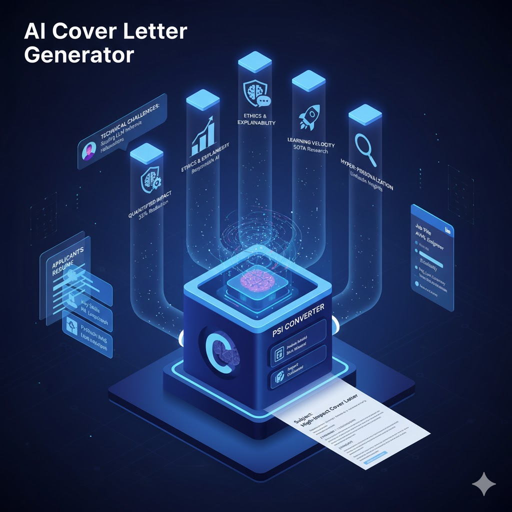

# 🤖 Mastering the AI Cover Letter: The PSI Method

This guide outlines the strategic framework for crafting high-impact cover letters for **Artificial Intelligence** roles. By using the **Problem-Solution-Impact (PSI)** method, you can effectively bridge the gap between your technical resume and a company's real-world business challenges.

---

## 🌟 Top 5 Qualities of an Outstanding AI Cover Letter

To land an interview in the competitive AI landscape, your cover letter must go beyond a simple list of skills. It must embody these five professional pillars:

1. **Quantified Impact:** Move beyond "knowing" tools to "delivering" results. Always lead with measurable outcomes (e.g.,  reduction in inference latency).
2. **Ethics & Explainability:** Demonstrate a commitment to **Responsible AI**. Show that you don't just build "black boxes," but prioritize model transparency and bias mitigation.
3. **The Translation Layer:** Prove you can explain complex neural network logic to non-technical stakeholders. This "bilingual" ability is the #1 soft skill for AI engineers.
4. **Learning Velocity:** The field moves at light speed. Mentioning your ability to implement the latest SOTA (State of the Art) research from arXiv shows you are future-proof.
5. **Hyper-Personalization:** Use LinkedIn "Intelligence." Reference a specific technical blog post or a challenge mentioned by the company's Engineering Lead to show genuine interest.

---

## 🛠 The PSI Method: Relating Skills to LinkedIn Insights

The **Problem-Solution-Impact (PSI)** method is a specialized framework designed to connect your key skills directly to a technical problem the company has recently publicized (e.g., on their LinkedIn Engineering blog).

* **Problem:** Identify a specific technical bottleneck the company is facing.
* **Solution:** Explain how your specific skill set (e.g., RAG, LLMOps, Fine-tuning) provides a direct remedy.
* **Impact:** Share a past success story that proves your solution delivers concrete value.

---

## 📄 The PSI Cover Letter Template

This template uses the Problem-Solution-Impact (PSI) method while weaving in the five core qualities: impact, ethics, communication, learning velocity, and personalization.

---

**[Your Name]** **[Your LinkedIn Profile URL] | [Your Portfolio/GitHub]**

**Subject:** [Job Title] – Solving [Company Name]’s [Specific AI Challenge]

**Dear [Hiring Manager Name or "AI Talent Team"],**

**[PROBLEM]** I noticed in [Company Name]’s recent technical blog post that you are currently scaling your [specific system, e.g., Agentic workflow or RAG pipeline], which often introduces significant challenges in model latency and hallucination management. In the rapidly evolving AI landscape, many organizations struggle to move past the "prototype phase" because they lack models that are both high-performing and ethically transparent. I am writing to you because I specialize in bridging this gap—ensuring that cutting-edge SOTA architectures aren't just technically impressive, but are production-ready, explainable, and aligned with business ROI.

**[SOLUTION]** To address similar bottlenecks in my previous role, I didn’t just deploy standard models; I engineered a [Specific Solution, e.g., custom fine-tuning strategy or hybrid retrieval-augmented system] using [Specific Tools, e.g., PyTorch and LangGraph]. My approach centers on Responsible AI; I prioritize building "The Translation Layer" by creating visualization dashboards that explain model decision-making to non-technical stakeholders. Furthermore, I maintain high learning velocity by actively implementing recent research from arXiv, such as [mention a recent trend like "Mamba architectures" or "Speculative Decoding"], ensuring your stack remains future-proof.

**[IMPACT]** The result of this methodology was a [Quantitative Impact, e.g., 35% reduction in inference costs and a 20% boost in retrieval accuracy] for [Previous Project/Company]. By hyper-personalizing AI solutions to meet specific user needs while maintaining strict ethical audits, I helped the organization realize immediate ROI. I am eager to bring this same focus on quantified impact and technical agility to the [Job Title] role at [Company Name]. I look forward to discussing how my background in [Your Niche] can help your team dominate the [Specific Industry] market.

**Best regards,**

**[Your Name]**

---

## 🚀 How to Use This Template

1. **Monitor LinkedIn:** Follow the company's Engineering or "Life" page to find recent technical updates.
2. **Select a "Problem":** Find a technical hurdle they mentioned (e.g., "Improving data quality for LLMs").
3. **Customize Brackets:** Replace the `[bracketed]` text with your actual skills and metrics.
4. **Proofread:** Ensure the "Translation Layer" (your writing style) is clear, professional, and concise.

**Would you like me to help you find a specific technical problem from a company's recent LinkedIn post to fill out the [PROBLEM] section of this template?**