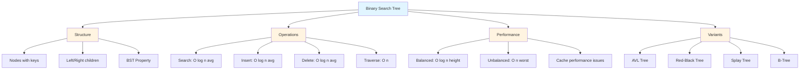
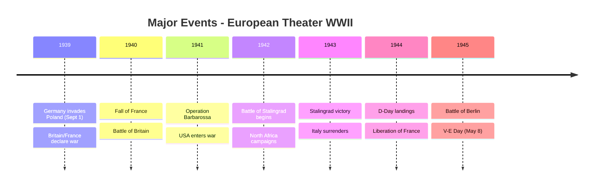
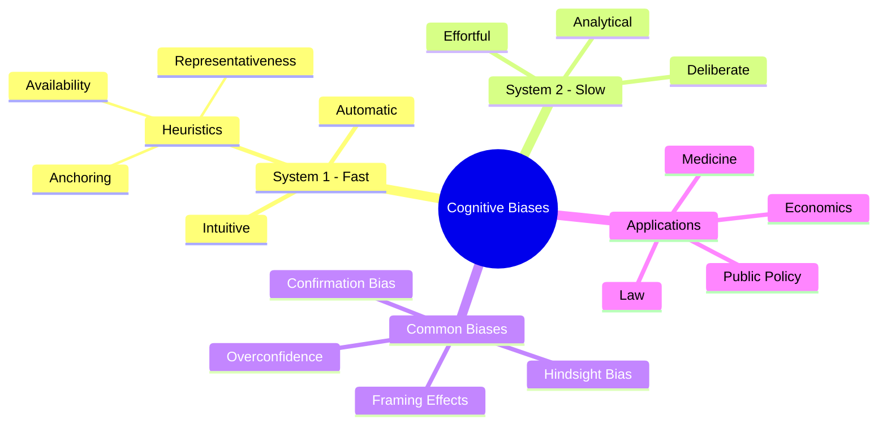
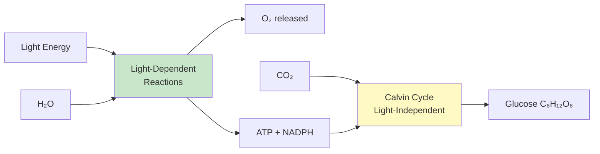
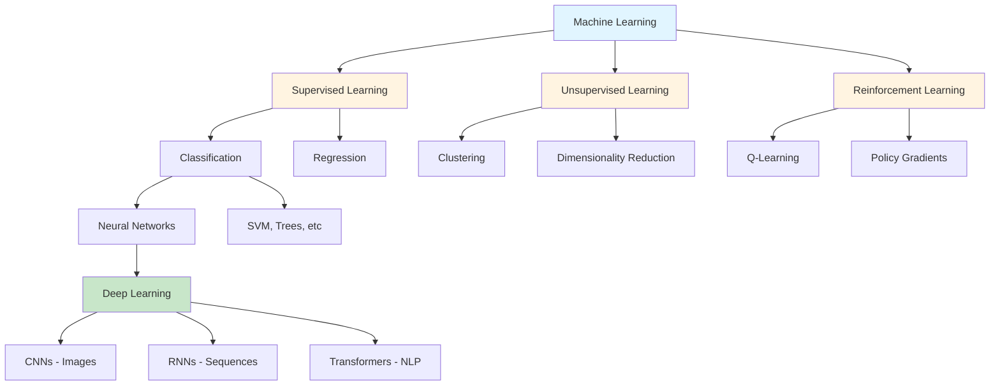

# Notes Generator - Comprehensive Examples

This document demonstrates the notes-generator skill across diverse academic disciplines and use cases.

---

## Example 1: Computer Science - Data Structures (Topic Only)

### User Request
```
Generate notes on binary search trees
```

### Skill Analysis
- **Topic Type**: Technical/Procedural
- **Bloom Levels Selected**: Understand, Apply, Analyze, Create (4 levels)
- **Research Required**: Yes (no reference file provided)
- **Expected Depth**: Moderate (5-7 points per level)

### Generated Notes Output

```markdown
# Binary Search Trees

## Summary

A Binary Search Tree (BST) is a hierarchical data structure where each node contains a value and has at most two children (left and right), maintaining the invariant that all values in the left subtree are less than the node's value, and all values in the right subtree are greater. BSTs enable efficient searching, insertion, and deletion operations with average O(log n) time complexity, making them fundamental for implementing associative arrays, priority queues, and database indexing. Understanding BST properties, operations, balancing strategies, and performance characteristics is essential for algorithm design and optimization.

**Learning Objectives:**
- Understand BST structure, properties, and invariants
- Implement core BST operations (search, insert, delete)
- Analyze time complexity and performance characteristics
- Design balanced tree variations to optimize worst-case behavior

---

## Notes by Bloom's Taxonomy

### 1. Understand: Conceptual Comprehension

- **Binary Search Tree Definition**: A binary tree data structure where each node contains a comparable key and satisfies the BST property: for any node N, all keys in the left subtree are less than N's key, and all keys in the right subtree are greater than N's key. This ordering property enables efficient search operations.

- **Structural Components**: Each BST node contains three elements: a data value (key), a reference to the left child node, and a reference to the right child node. Null references indicate absence of children. The topmost node is called the root; nodes without children are leaves.

- **BST Property Invariant**: The fundamental invariant states that an in-order traversal (left-root-right) of a BST visits nodes in sorted ascending order. This property must be maintained after every modification operation (insertion or deletion) to preserve the tree's correctness.

- **Height and Balance**: Tree height is the longest path from root to leaf. A balanced BST has height approximately log₂(n) for n nodes, yielding O(log n) operations. An unbalanced tree degrades to O(n) in worst case (resembles linked list when nodes inserted in sorted order).

- **Comparison with Other Structures**: Unlike arrays (O(n) insertion/deletion), BSTs provide O(log n) average-case operations. Unlike hash tables (which require hash functions and handle collisions), BSTs maintain sorted order and support range queries efficiently. Unlike heaps (which only maintain partial order), BSTs enable both min/max access and arbitrary key searches.

- **Duplicate Handling Strategies**: Different implementations handle duplicates differently: (1) disallow duplicates entirely, (2) allow duplicates in right subtree (modified invariant: left < root ≤ right), (3) maintain count field in nodes, or (4) use additional linked structures for duplicate values.

- **Tree Traversal Methods**: Three primary traversal strategies exist: in-order (left-root-right, produces sorted sequence), pre-order (root-left-right, useful for tree copying), and post-order (left-right-root, useful for deletion). Level-order traversal visits nodes by depth level using queue-based breadth-first search.

### 2. Apply: Practical Application

- **Search Operation Implementation**: Start at root, compare search key with current node. If equal, return node (found). If less, recurse left; if greater, recurse right. Return null if subtree is empty (not found). Pseudocode: `search(node, key): if node == null or node.key == key: return node; if key < node.key: return search(node.left, key); else: return search(node.right, key)`.

- **Insertion Operation Implementation**: Search for insertion position (search until finding null reference where new node belongs), then create new node and attach to parent. Maintains BST property because insertion position determined by comparison operations. Pseudocode: `insert(node, key): if node == null: return new Node(key); if key < node.key: node.left = insert(node.left, key); else: node.right = insert(node.right, key); return node`.

- **Finding Minimum/Maximum**: Minimum value is leftmost node (follow left pointers until null). Maximum value is rightmost node (follow right pointers until null). Both operations O(h) where h is height. Used in deletion operation to find in-order successor/predecessor.

- **Deletion Operation (Three Cases)**: Case 1 - Node has no children: simply remove (set parent's pointer to null). Case 2 - Node has one child: bypass deleted node (set parent's pointer to child). Case 3 - Node has two children: find in-order successor (minimum in right subtree), copy successor's value to deleted node, recursively delete successor.

- **Range Query Implementation**: To find all values in range [min, max], use modified in-order traversal: recurse left only if min < current, process current if min ≤ current ≤ max, recurse right only if current < max. This prunes branches outside range, improving efficiency over full traversal.

- **BST Construction from Array**: Given unsorted array, insert elements sequentially. Result depends on insertion order: sorted array produces degenerate tree (linked list), random order produces relatively balanced tree. For guaranteed balance, sort array first and use divide-and-conquer: make middle element root, recursively build left subtree from left half, right subtree from right half.

### 3. Analyze: Critical Examination

- **Time Complexity Analysis**: Search, insert, and delete operations depend on tree height h. Average case (balanced tree): O(log n) because h ≈ log₂(n). Worst case (degenerate tree): O(n) because h = n. Space complexity: O(n) for storing n nodes, O(h) auxiliary space for recursive call stack.

- **Balance Factor and Degradation**: Balance factor of node = height(right subtree) - height(left subtree). Balanced if all nodes have balance factor ∈ {-1, 0, 1}. Insertion of sorted or nearly-sorted data causes severe imbalance (creates linked list structure), degrading performance from O(log n) to O(n). Detecting imbalance requires height calculation, which itself costs O(n) for full tree.

- **Comparison of Deletion Strategies**: Two-child deletion has two approaches: (1) replace with in-order successor (minimum of right subtree) or (2) replace with in-order predecessor (maximum of left subtree). Alternating between strategies helps maintain balance. Successor approach preferred for right-heavy trees, predecessor for left-heavy trees.

- **Memory Locality and Cache Performance**: BSTs exhibit poor cache performance compared to arrays because nodes scattered in memory (pointer-based structure). Each traversal step potentially causes cache miss. Array-based structures (heap, B-tree) demonstrate better cache locality through contiguous storage.

- **Balancing Strategy Necessity**: Self-balancing variants (AVL, Red-Black, Splay trees) maintain O(log n) worst-case performance through rotations after modifications. Trade-off: simpler BST has faster individual operations (no rebalancing overhead) but unreliable performance; self-balancing trees guarantee logarithmic operations with constant-factor overhead.

- **Recursive vs. Iterative Implementations**: Recursive implementations elegant but consume O(h) stack space. Iterative implementations using explicit stack or parent pointers avoid recursion overhead. For unbalanced trees with h ≈ n, recursive approach risks stack overflow. Tail-recursive operations (search) easily converted to iteration.

### 4. Create: Synthesis and Innovation

- **Design Custom BST Variant**: Create augmented BST storing subtree size at each node. Enables O(log n) rank queries (find kth smallest element) and order statistics. Modification operations update size fields during tree traversal. Applications include implementing order-statistic trees for dynamic rankings, leaderboards, or percentile calculations.

- **Persistent BST Implementation**: Design immutable BST where modifications create new tree versions while preserving old versions (path copying). Each modification copies O(log n) nodes along path from root to modified node. Enables version control, undo/redo functionality, and concurrent read access without locks. Applications in functional programming languages and temporal databases.

- **BST-Based Index Structure**: Implement database index using BST where keys are indexed column values and nodes store pointers to table rows. Support efficient exact-match queries, range scans, and ordered iteration. Enhancement: augment nodes with statistical information (min/max in subtree) to optimize query planning.

- **Threaded BST for Efficient Traversal**: Design BST where null pointers replaced with threads (links to in-order predecessor/successor). Eliminates recursion and explicit stack for traversal, achieving O(1) space complexity. Right threads point to in-order successor, left threads to predecessor (or null). Applications in memory-constrained environments requiring frequent traversals.

- **Concurrent BST with Fine-Grained Locking**: Design thread-safe BST using lock coupling (hand-over-hand locking): acquire lock on node before releasing parent's lock. Enables concurrent operations by different threads. Trade-off: locking overhead vs. parallelism. Alternative: optimistic approaches using atomic operations or lock-free algorithms (more complex but higher concurrency).

- **BST Visualization Tool**: Create interactive visualization showing insertion/deletion animations, rotation operations for self-balancing variants, and complexity analysis. Display tree graphically with node colors indicating balance factors or violation states. Educational tool demonstrating how different insertion orders affect tree shape and performance.

---

## Visual Concept Map



---

## Practice Questions

### Knowledge & Comprehension

1. **Define** the BST property that must hold for every node in a binary search tree.

2. **Explain** why an in-order traversal of a BST produces a sorted sequence of values.

3. **Describe** the three cases that must be handled when deleting a node from a BST.

### Application & Analysis

4. **Implement** the pseudocode or actual code for searching for a value in a BST using recursion.

5. **Analyze** the time complexity of searching in a BST when elements are inserted in sorted ascending order. Why does this produce worst-case performance?

6. **Compare** the advantages and disadvantages of using a BST versus a hash table for implementing a symbol table that requires both search and sorted iteration.

### Evaluation & Creation

7. **Evaluate** whether a standard BST or a self-balancing variant (AVL/Red-Black) would be more appropriate for a dictionary application with frequent insertions in alphabetical order. Justify your choice considering performance and implementation complexity.

8. **Design** a modified BST that can efficiently answer the query "How many elements in the tree are less than value X?" in O(log n) time. What information must each node store, and how would the operations be modified?

---

## References and Further Reading

### Primary Sources
- Cormen, T. H., Leiserson, C. E., Rivest, R. L., & Stein, C. (2022). *Introduction to Algorithms* (4th ed.). MIT Press. Chapter 12: Binary Search Trees.
- Sedgewick, R., & Wayne, K. (2011). *Algorithms* (4th ed.). Addison-Wesley. Section 3.2: Binary Search Trees.

### Recommended Resources
- [VisuAlgo Binary Search Tree Visualizations](https://visualgo.net/en/bst) - Interactive animations of BST operations
- [MIT OpenCourseWare: Binary Search Trees](https://ocw.mit.edu/courses/6-006-introduction-to-algorithms-spring-2020/) - Lecture videos and notes
- [GeeksforGeeks BST Tutorial](https://www.geeksforgeeks.org/binary-search-tree-data-structure/) - Implementation examples in multiple languages

### Related Topics
- AVL Trees (self-balancing BST variant)
- Red-Black Trees (widely used in language libraries: C++ STL, Java TreeMap)
- B-Trees (generalization for database indexing)
- Trie (specialized tree for string keys)
- Heap (different tree structure optimized for priority queues)
```

---

## Example 2: History - World War II (Topic with Specific Focus)

### User Request
```
Create notes on World War II, focusing on the European theater
```

### Skill Analysis
- **Topic Type**: Historical/Factual with analytical components
- **Bloom Levels Selected**: Remember, Understand, Analyze, Evaluate (4 levels)
- **Research Required**: Yes
- **Expected Depth**: Moderate (5-7 points per level)

### Generated Notes Output (Abbreviated)

```markdown
# World War II: European Theater

## Summary

The European Theater of World War II (1939-1945) encompassed the military campaigns between Allied and Axis powers across Europe, North Africa, and the Atlantic. Beginning with Germany's invasion of Poland and concluding with the unconditional surrender of Nazi Germany, this conflict reshaped global political order, resulted in unprecedented casualties (over 40 million deaths), and revealed the horrors of industrialized genocide. Understanding the causes, major campaigns, key turning points, and consequences provides essential context for modern European history and international relations.

**Learning Objectives:**
- Remember key dates, leaders, and battles of the European Theater
- Understand the political, economic, and ideological factors driving the conflict
- Analyze strategic decisions and their impact on war outcomes
- Evaluate the long-term consequences on European society and geopolitics

---

## Notes by Bloom's Taxonomy

### 1. Remember: Foundational Knowledge

- **Key Dates**: September 1, 1939 (Germany invades Poland), May 10, 1940 (Western Front offensive begins), June 22, 1941 (Operation Barbarossa - invasion of USSR), December 11, 1941 (Germany declares war on USA), June 6, 1944 (D-Day landings), May 8, 1945 (V-E Day - victory in Europe).

- **Major Allied Leaders**: Winston Churchill (UK Prime Minister 1940-1945), Franklin D. Roosevelt (US President 1933-1945), Joseph Stalin (Soviet Premier), Charles de Gaulle (Free French leader), Dwight D. Eisenhower (Supreme Allied Commander Europe).

- **Major Axis Leaders**: Adolf Hitler (German Führer), Benito Mussolini (Italian Duce until 1943), Hermann Göring (Luftwaffe commander), Erwin Rommel (Afrika Korps commander).

- **Critical Battles**: Battle of Britain (1940), Operation Barbarossa (1941), Siege of Leningrad (1941-1944), Battle of Stalingrad (1942-1943), Battle of Kursk (1943), D-Day Normandy Invasion (1944), Battle of the Bulge (1944-1945).

- **Geographic Scope**: Major combat zones included Western Europe (France, Low Countries, Germany), Eastern Europe (Poland, USSR), Southern Europe (Italy, Balkans, Greece), North Africa (Egypt, Libya, Tunisia), Scandinavia (Norway, Finland).

- **The Holocaust**: Systematic genocide by Nazi regime targeting Jews, Roma, disabled individuals, political opponents, resulting in approximately 6 million Jewish deaths. Key components: concentration camps (Auschwitz, Treblinka, Dachau), mobile killing units (Einsatzgruppen), Final Solution policy (Wannsee Conference, January 1942).

[Additional Remember points...]

### 2. Understand: Conceptual Comprehension

- **Origins in Treaty of Versailles**: The 1919 treaty ending WWI imposed harsh reparations on Germany, territorial losses, and military restrictions. Economic hardship and national humiliation created conditions for extremist movements. Hitler exploited this resentment, promising to restore German greatness and overturn Versailles terms.

- **Appeasement Policy Failure**: British and French leaders pursued appeasement (1930s), making concessions to avoid war: allowing German rearmament, Rhineland remilitarization (1936), Austria's annexation (Anschluss, 1938), Czechoslovakia's partition (Munich Agreement, 1938). This strategy failed because it emboldened Hitler while allowing German military buildup.

[Additional Understand points...]

### 3. Analyze: Critical Examination

- **Strategic Significance of Stalingrad**: Germany's defeat at Stalingrad (February 1943) marked the Eastern Front's turning point. Analysis reveals multiple factors: Soviet defense-in-depth strategy exhausted German forces, Hitler's refusal to allow retreat trapped the 6th Army, Soviet counteroffensive (Operation Uranus) created encirclement. This battle demonstrated limits of German operational capabilities and shifted strategic initiative to USSR.

[Additional Analyze points...]

### 4. Evaluate: Assessment and Judgment

- **Effectiveness of Strategic Bombing Campaign**: Allied bombing of German cities (RAF night bombing, USAAF precision daylight raids) aimed to destroy industrial capacity and civilian morale. Assessment: achieved mixed results - disrupted production and forced resource diversion to air defense, but failed to break civilian morale and diverted resources from tactical air support. Ethical considerations regarding civilian casualties (Dresden, Hamburg firestorms) remain controversial.

[Additional Evaluate points...]

---

## Visual Concept Map



---

## Practice Questions

### Knowledge & Comprehension
1. **List** three major battles on the Eastern Front and their dates.
2. **Explain** why the Battle of Britain was strategically significant for both Germany and Britain.

### Application & Analysis
3. **Analyze** how Germany's two-front war (Western and Eastern fronts simultaneously) contributed to its defeat.
4. **Compare** the military strategies employed by Germany in the invasions of France (1940) and the Soviet Union (1941). What were the key differences and outcomes?

### Evaluation & Creation
5. **Evaluate** the decision by the Western Allies to prioritize the "Europe First" strategy over the Pacific Theater. Was this the optimal allocation of resources?
6. **Assess** the moral and strategic justifications for the Allied strategic bombing campaign against German cities.

---

## References and Further Reading

### Primary Sources
- Churchill, Winston. *The Second World War* (6 volumes). Historical memoir by British PM.
- Shirer, William L. *The Rise and Fall of the Third Reich*. Comprehensive history based on captured German documents.

### Recommended Resources
- Beevor, Antony. *The Second World War*. Comprehensive single-volume history.
- [United States Holocaust Memorial Museum](https://www.ushmm.org/) - Extensive resources on Holocaust history
- [Imperial War Museums Digital Collections](https://www.iwm.org.uk/) - Primary sources, photos, documents

### Related Topics
- Pacific Theater of World War II
- Cold War origins and post-war European division
- Nuremberg Trials and international law
- Marshall Plan and European reconstruction
```

---

## Example 3: Psychology - Cognitive Biases (Reference File Provided)

### User Request
```
Generate notes from this research paper: cognitive-biases-kahneman.pdf
```

### Skill Analysis
- **Topic Type**: Conceptual/Theoretical (psychological science)
- **Bloom Levels Selected**: Understand, Apply, Analyze, Evaluate (4 levels)
- **Research Required**: No (reference file provided)
- **Source**: Academic paper on cognitive biases by Daniel Kahneman

### Skill Execution
1. Read cognitive-biases-kahneman.pdf
2. Extract core concepts: System 1/System 2 thinking, heuristics, specific biases
3. Classify as conceptual topic → select appropriate Bloom levels
4. Generate notes based on paper content
5. Create mind map showing bias categories and relationships
6. Develop practice questions applying biases to scenarios
7. Include paper as primary reference, add related readings

### Generated Notes Output (Abbreviated)

```markdown
# Cognitive Biases and Heuristics

## Summary

Cognitive biases are systematic patterns of deviation from rationality in judgment and decision-making. Daniel Kahneman's research distinguishes between System 1 (fast, automatic, intuitive) and System 2 (slow, deliberate, analytical) thinking processes. Heuristics—mental shortcuts employed by System 1—enable rapid decisions but introduce predictable biases including availability, representativeness, and anchoring effects. Understanding these biases illuminates human irrationality, improves decision-making, and applies to fields including economics, medicine, law, and public policy.

**Learning Objectives:**
- Understand dual-process theory (System 1 vs. System 2)
- Apply knowledge of biases to recognize flawed reasoning
- Analyze how heuristics produce systematic errors
- Evaluate strategies for mitigating bias in decision-making

---

## Notes by Bloom's Taxonomy

### 2. Understand: Conceptual Comprehension

- **Dual-Process Theory**: Human cognition employs two distinct systems. System 1 operates automatically, quickly, with little effort and no voluntary control (intuition, snap judgments). System 2 allocates attention to effortful mental activities requiring deliberation (complex calculations, critical analysis). Most daily activities rely on System 1; System 2 activated for novel or difficult tasks.

- **Availability Heuristic**: People estimate probability or frequency based on how easily examples come to mind. Recent, vivid, or emotionally charged events are more "available" mentally, leading to overestimation of their likelihood. Example: After seeing news coverage of airplane crashes, people overestimate flight danger relative to statistical reality (driving is far more dangerous per mile).

[Additional Understand points on representativeness heuristic, anchoring effect, etc...]

### 3. Apply: Practical Application

- **Recognizing Availability Bias in Medical Diagnosis**: Physicians may overdiagnose conditions they've recently encountered or studied, because those diagnoses are mentally available. Application: Implement diagnostic checklists forcing systematic consideration of alternatives rather than relying on first intuition. Consider base rates (actual frequency in population) not just symptom similarity to recent cases.

- **Mitigating Anchoring in Negotiations**: Negotiators are biased by initial offers (anchors), even when arbitrary. Application strategy: Make first offer to set favorable anchor, or if receiving first offer, explicitly consider wider range before responding. Use objective criteria (market rates, precedents) to counteract arbitrary anchors.

[Additional Apply points...]

### 4. Analyze: Critical Examination

- **Why Heuristics Persist Despite Errors**: Evolutionary analysis suggests heuristics developed in ancestral environments where fast decisions (threat detection) were fitness-advantageous. Modern environments present statistical/probabilistic problems rare in evolutionary history. Analysis reveals trade-off: heuristics sacrifice accuracy for speed/efficiency. In high-stakes, statistical domains (medicine, finance, law), this trade-off becomes problematic.

[Additional Analyze points...]

### 5. Evaluate: Assessment and Judgment

- **Effectiveness of Debiasing Interventions**: Research on reducing bias shows mixed results. Simple awareness training has limited impact—knowing about bias doesn't prevent it. More effective: structured decision procedures (checklists, algorithms), accountability mechanisms, and "consider-the-opposite" strategies. Evaluation: Individual debiasing difficult (biases are automatic), but institutional/procedural safeguards show promise. Cost-benefit assessment must weigh intervention expense against decision stakes.

[Additional Evaluate points...]

---

## Visual Concept Map



---

## Practice Questions

### Knowledge & Comprehension
1. **Define** System 1 and System 2 thinking. Provide an example of each from everyday life.
2. **Explain** the availability heuristic and why it leads to systematic errors in probability estimation.

### Application & Analysis
3. **Apply** your understanding of anchoring bias to explain why stores often display "original price" alongside "sale price." How does this influence purchasing decisions?

4. **Analyze** a real-world scenario: After a shark attack receives extensive media coverage, beach attendance drops significantly despite unchanged actual risk. Which cognitive bias explains this behavior, and what is the mechanism?

### Evaluation & Creation
5. **Evaluate** whether teaching students about cognitive biases in high school would be worthwhile. Consider potential benefits, limitations of awareness training, and alternative approaches.

6. **Design** a decision-making procedure for a hospital emergency department that minimizes the impact of availability and anchoring biases on diagnostic accuracy.

---

## References and Further Reading

### Primary Sources
- Kahneman, D., & Tversky, A. (1974). "Judgment under Uncertainty: Heuristics and Biases." *Science*, 185(4157), 1124-1131. [Original research paper provided]
- Kahneman, D. (2011). *Thinking, Fast and Slow*. Comprehensive overview of bias research.

### Recommended Resources
- [Wikipedia List of Cognitive Biases](https://en.wikipedia.org/wiki/List_of_cognitive_biases) - Comprehensive catalog
- [LessWrong Sequences](https://www.lesswrong.com/rationality) - Applied rationality and debiasing techniques
- [Yale Open Course: Introduction to Psychology](https://oyc.yale.edu/psychology/psyc-110) - Lectures on judgment and decision-making

### Related Topics
- Behavioral Economics (application of bias research to economic theory)
- Nudge Theory (using biases to improve decisions through choice architecture)
- Prospect Theory (decision-making under risk and uncertainty)
- Metacognition (thinking about one's own thinking processes)
```

---

## Example 4: Quick Notes - Simple Topic

### User Request
```
Quick notes on photosynthesis for high school biology
```

### Skill Analysis
- **Topic Type**: Scientific/Procedural
- **Depth Request**: "Quick notes" → triggers minimal mode
- **Bloom Levels Selected**: Remember, Understand, Apply (3 levels)
- **Points per Level**: 4-5 (reduced from standard 5-7)
- **Audience**: High school level (accessible language)

### Generated Notes Output (Abbreviated)

```markdown
# Photosynthesis (Quick Reference)

## Summary

Photosynthesis is the process by which plants, algae, and some bacteria convert light energy into chemical energy stored in glucose molecules. Using chlorophyll pigments in chloroplasts, organisms capture sunlight and use it to transform carbon dioxide and water into glucose and oxygen. This process sustains nearly all life on Earth by producing oxygen and forming the base of food chains.

**Learning Objectives:**
- Remember the overall equation and key components
- Understand the light-dependent and light-independent reactions
- Apply knowledge to explain plant growth and ecological relationships

---

## Notes by Bloom's Taxonomy

### 1. Remember: Foundational Knowledge

- **Overall Equation**: 6CO₂ + 6H₂O + light energy → C₆H₁₂O₆ + 6O₂
  (Carbon dioxide + water + light → glucose + oxygen)

- **Location**: Occurs in chloroplasts, organelles found in plant cells and algae. Chloroplasts contain chlorophyll (green pigment that absorbs light) and are most concentrated in leaf cells.

- **Key Components**: Chlorophyll (light-absorbing pigment), water (electron source), carbon dioxide (carbon source), light energy (from sun), ATP and NADPH (energy carriers).

- **Two Main Stages**: Light-dependent reactions (occur in thylakoid membranes, require light) and light-independent reactions/Calvin Cycle (occur in stroma, use products from light reactions).

### 2. Understand: Conceptual Comprehension

- **Light-Dependent Reactions**: Light energy excites electrons in chlorophyll. These high-energy electrons pass through electron transport chain, powering ATP synthesis and reducing NADP⁺ to NADPH. Water molecules split (photolysis), releasing oxygen as byproduct. Products (ATP and NADPH) used in Calvin Cycle.

- **Calvin Cycle (Light-Independent)**: Uses ATP and NADPH from light reactions to convert CO₂ into glucose. Occurs in three phases: carbon fixation (CO₂ attaches to RuBP via rubisco enzyme), reduction (using ATP/NADPH to form G3P sugar), and regeneration (RuBP reformed to continue cycle). Does not directly require light but depends on light reaction products.

- **Why Plants Are Green**: Chlorophyll absorbs red and blue wavelengths of light but reflects green wavelengths. Our eyes detect the reflected green light, making plants appear green. Red/blue light most effective for photosynthesis.

- **Relationship to Cellular Respiration**: Photosynthesis and cellular respiration are complementary processes. Photosynthesis produces glucose and oxygen; respiration consumes glucose and oxygen to produce ATP, CO₂, and water. Together they cycle energy and matter through ecosystems.

### 3. Apply: Practical Application

- **Explaining Plant Growth**: Plants grow by using glucose produced in photosynthesis as both energy source (cellular respiration breaks down glucose for ATP) and building material (glucose molecules combined to form cellulose for cell walls, starches for storage).

- **Limiting Factors**: Photosynthesis rate limited by available light, CO₂ concentration, water availability, and temperature. In greenhouses, farmers optimize these factors: add artificial light, increase CO₂ levels, ensure irrigation, maintain optimal temperature to maximize crop growth.

- **Seasonal Changes**: Deciduous trees lose leaves in fall because shorter days/less sunlight make photosynthesis less efficient than cost of maintaining leaves. Chlorophyll breaks down, revealing other pigments (carotenoids = yellow/orange, anthocyanins = red), creating fall colors.

---

## Visual Concept Map



---

## Practice Questions

1. **Write** the balanced chemical equation for photosynthesis.

2. **Explain** why oxygen is released as a byproduct of photosynthesis. Which stage produces it?

3. **Apply**: A plant is placed in a dark closet for one week. What would happen to its photosynthesis rate and why? Would it survive?

4. **Analyze**: Why do plants in deep ocean water often appear red or brown instead of green?

---

## References and Further Reading

### Primary Sources
- Campbell Biology (High School Edition), Chapter on Photosynthesis

### Recommended Resources
- [Khan Academy: Photosynthesis](https://www.khanacademy.org/science/biology/photosynthesis-in-plants) - Video tutorials
- [Crash Course Biology #8: Photosynthesis](https://www.youtube.com/watch?v=uixA8ZXx0KU) - Engaging video overview

### Related Topics
- Cellular Respiration (complementary process)
- Chloroplast structure and function
- Ecological energy flow and food chains
```

---

## Example 5: Multi-Reference Synthesis

### User Request
```
Generate notes on machine learning from these three files:
- ml-intro-textbook.pdf
- neural-networks-paper.pdf
- practical-ml-guide.md
```

### Skill Analysis
- **Topic Type**: Technical/Conceptual
- **Sources**: Three files with different perspectives (textbook = theory, paper = specialized topic, guide = practical)
- **Strategy**: Synthesize complementary information, note source-specific insights
- **Bloom Levels Selected**: Understand, Apply, Analyze, Evaluate, Create (5 levels)

### Skill Execution Process
1. Read all three files separately
2. Extract key concepts from each:
   - Textbook: Foundational theory, algorithm categories, mathematical foundations
   - Paper: Deep dive into neural network architectures
   - Guide: Implementation best practices, tooling, real-world considerations
3. Synthesize overlapping concepts (e.g., all discuss supervised learning)
4. Preserve unique contributions (paper's neural network details, guide's practical tips)
5. Attribute source-specific claims
6. Generate comprehensive notes integrating all perspectives

### Generated Notes Output (Abbreviated)

```markdown
# Machine Learning

## Summary

Machine Learning (ML) is a subfield of artificial intelligence enabling computers to learn patterns from data without explicit programming. ML algorithms fall into three main categories: supervised learning (learning from labeled examples), unsupervised learning (finding structure in unlabeled data), and reinforcement learning (learning from reward signals). This synthesis covers theoretical foundations, neural network architectures, and practical implementation considerations, integrating perspectives from theoretical texts, specialized research, and practitioner guides.

**Learning Objectives:**
- Understand ML paradigms and core algorithms
- Apply ML techniques to real-world problems
- Analyze trade-offs in algorithm selection and model design
- Evaluate model performance and identify improvement strategies
- Create end-to-end ML solutions considering practical constraints

---

## Notes by Bloom's Taxonomy

### 2. Understand: Conceptual Comprehension

- **Supervised Learning Paradigm**: Algorithms learn mapping from inputs (features) to outputs (labels) using labeled training data. Training process minimizes difference between predictions and true labels. Examples: classification (discrete labels like spam/not-spam) and regression (continuous values like house prices). Common algorithms: linear regression, logistic regression, decision trees, support vector machines, neural networks.
  (References: [1], [3])

- **Neural Network Architecture**: Composed of layers of interconnected artificial neurons. Each neuron receives weighted inputs, applies activation function (introducing non-linearity), and passes output to next layer. Training via backpropagation: compute error gradient with respect to weights using chain rule, update weights to minimize loss function. Deep networks (many layers) learn hierarchical representations.
  (Reference: [2] - specialized coverage of architectures including CNNs, RNNs, transformers)

[Additional Understand points synthesizing all three sources...]

### 3. Apply: Practical Application

- **Implementing a Classification Pipeline**: Practical workflow from practitioner guide: (1) collect and explore data using pandas, (2) split into train/validation/test sets (e.g., 70/15/15), (3) preprocess features (normalization, encoding categorical variables), (4) select algorithm (start simple: logistic regression), (5) train model using scikit-learn: `model.fit(X_train, y_train)`, (6) evaluate on validation set, (7) tune hyperparameters, (8) final evaluation on test set.
  (Reference: [3] - practical-ml-guide.md provides code examples and library recommendations)

[Additional Apply points...]

### 4. Analyze: Critical Examination

- **Bias-Variance Tradeoff**: Theoretical analysis shows fundamental tradeoff between model bias (underfitting - model too simple) and variance (overfitting - model too complex, sensitive to training data noise). Total error = bias² + variance + irreducible error. Simple models (linear regression) have high bias, low variance. Complex models (deep neural networks) have low bias, high variance. Optimal complexity balances both. Regularization techniques (L1, L2, dropout) reduce variance.
  (Reference: [1] - mathematical treatment of bias-variance decomposition)

[Additional Analyze points combining theoretical foundations from textbook with neural network-specific analysis from paper...]

### 5. Evaluate: Assessment and Judgment

- **Assessing Neural Networks vs. Traditional ML**: Neural networks excel at high-dimensional data (images, text, audio) where manual feature engineering difficult, achieving state-of-art performance on complex tasks. However, they require large datasets (thousands to millions of examples), substantial computational resources (GPUs), and extensive hyperparameter tuning. Traditional algorithms (random forests, gradient boosting) often preferable for structured/tabular data with limited samples, offering faster training, better interpretability, and competitive performance.
  (References: [2] for neural network capabilities, [3] for practical trade-offs in algorithm selection)

[Additional Evaluate points...]

### 6. Create: Synthesis and Innovation

- **Designing a Hybrid Recommendation System**: Synthesize collaborative filtering (using user behavior patterns) and content-based filtering (using item features). Architecture: use neural network to learn user and item embeddings from interaction data (collaborative component), concatenate with hand-crafted content features (genres, prices, descriptions), feed combined representation to final layers predicting user-item affinity. Addresses cold-start problem (new users/items) through content features while leveraging collaborative patterns for established users.
  (Synthesis of concepts from all three references: neural architectures [2], ensemble approaches [1], production considerations [3])

[Additional Create points...]

---

## Visual Concept Map



---

## Practice Questions

[Questions synthesizing content from all three sources...]

---

## References and Further Reading

### Primary Sources
[1] ml-intro-textbook.pdf - Theoretical foundations and mathematical treatment
[2] neural-networks-paper.pdf - Specialized coverage of neural architectures
[3] practical-ml-guide.md - Implementation best practices and tooling

### Recommended Resources
- Goodfellow, I., Bengio, Y., & Courville, A. (2016). *Deep Learning*. MIT Press.
- Géron, A. (2019). *Hands-On Machine Learning with Scikit-Learn, Keras, and TensorFlow*.
- [fast.ai Practical Deep Learning Course](https://course.fast.ai/) - Implementation-focused tutorials

### Related Topics
- Statistical Learning Theory
- Computer Vision applications
- Natural Language Processing
- MLOps and production deployment
```

---

## Summary of Examples

| Example | Topic | Type | Bloom Levels | Depth | Special Features |
|---------|-------|------|--------------|-------|------------------|
| 1 | Binary Search Trees | Technical | 4 levels | Moderate | Algorithm analysis, complexity |
| 2 | WWII European Theater | Historical | 4 levels | Moderate | Timeline diagram, ethical considerations |
| 3 | Cognitive Biases | Conceptual | 4 levels | Moderate | Reference file, applied psychology |
| 4 | Photosynthesis | Scientific | 3 levels | Quick (4-5 pts) | High school audience, simplified |
| 5 | Machine Learning | Technical | 5 levels | Moderate | Multi-source synthesis, citations |

These examples demonstrate the notes-generator skill's adaptability across:
- **Disciplines**: Computer science, history, psychology, biology
- **Complexity levels**: Quick reference to comprehensive analysis
- **Source types**: Topic-only (research), reference files, multi-file synthesis
- **Audience levels**: High school to advanced/professional
- **Bloom's Taxonomy coverage**: 3-5 levels, adaptively selected
