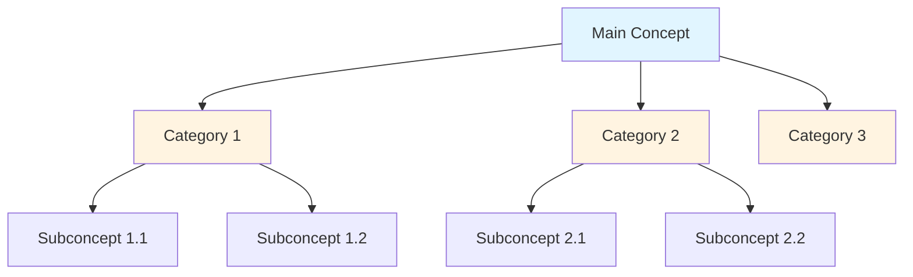
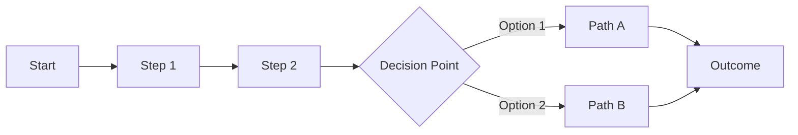
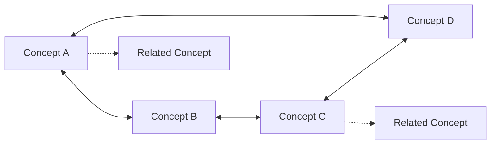
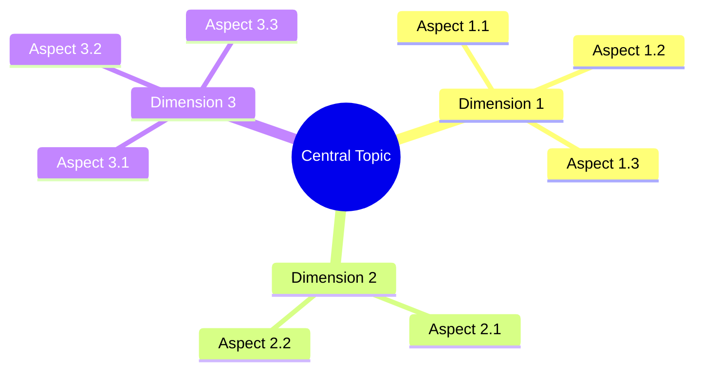
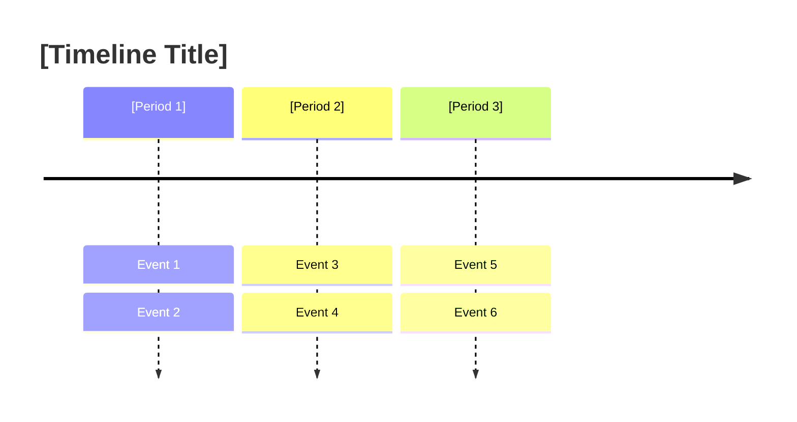

# [Topic Title]

## Summary

[3-5 sentence executive summary covering:]
- [Topic definition and scope]
- [Primary learning objectives]
- [Key concepts that will be covered]
- [Practical applications or relevance]

**Learning Objectives:**
- [Objective 1 - typically aligned with first Bloom level]
- [Objective 2 - typically aligned with second Bloom level]
- [Objective 3 - typically aligned with third Bloom level]
- [Objective 4 - if applicable]

---

## Notes by Bloom's Taxonomy

### 1. Remember: Foundational Knowledge
*[Use this level for factual topics, terminology-heavy subjects, or when foundational recall is essential]*

- **[Key Term/Concept 1]**: [Definition with context. Include example if helpful for memorization. Aim for 2-3 sentences.]

- **[Key Term/Concept 2]**: [Definition with context. Include example if helpful for memorization. Aim for 2-3 sentences.]

- **[Key Term/Concept 3]**: [Definition with context. Include example if helpful for memorization. Aim for 2-3 sentences.]

- **[Key Fact/Date/Figure 4]**: [Factual information with significance explained. Why is this important to remember?]

- **[Core Component 5]**: [Essential element with description. What role does it play in the larger topic?]

*[Continue for 5-7 total points at moderate depth, or 4-5 for quick notes, or 7-9 for comprehensive coverage]*

---

### 2. Understand: Conceptual Comprehension
*[Always include this level - fundamental for all learning]*

- **[Concept Explanation 1]**: [Explain the concept in accessible language. What does it mean? How does it work? Include comparison/contrast if helpful. Example demonstrating the concept. 3-4 sentences.]

- **[Concept Explanation 2]**: [Explain the concept in accessible language. What does it mean? How does it work? Include comparison/contrast if helpful. Example demonstrating the concept. 3-4 sentences.]

- **[Cause-Effect Relationship]**: [Describe how one thing leads to another. What is the mechanism? What are the implications? Include concrete example.]

- **[Interpretation of Core Idea]**: [Paraphrase and explain key idea. What does this mean in practical terms? How can we understand it intuitively?]

- **[Comparison/Contrast]**: [How is concept X similar to or different from concept Y? What are the key distinguishing features? When would you use one vs. the other?]

*[Continue for 5-7 total points]*

---

### 3. Apply: Practical Application
*[Use for procedural, technical, or skill-based topics where application is relevant]*

- **[Practical Use Case 1]**: [Describe how to apply the concept in real-world scenario. Include step-by-step procedure if applicable. What would you actually do? 3-4 sentences with code/example if relevant.]

- **[Implementation Example 2]**: [Concrete example of applying the concept. Show actual usage with code snippet, formula, or detailed procedure.]

- **[Problem-Solving Approach]**: [How would you solve a typical problem using this concept? What is the methodology? Walk through an example scenario.]

- **[Real-World Application]**: [Where is this concept used in practice? Industry examples, professional contexts, or everyday situations where it applies.]

- **[Procedure/Algorithm]**: [Step-by-step method for performing task or solving problem. Include decision points or variations if applicable.]

*[Continue for 5-7 total points]*

---

### 4. Analyze: Critical Examination
*[Use for topics requiring decomposition, pattern recognition, or comparative analysis]*

- **[Component Breakdown]**: [Break down complex concept into constituent parts. How do the parts relate? What is the structure? How do components interact?]

- **[Relationship Mapping]**: [Identify and explain relationships between elements. What depends on what? What influences what? Causal connections?]

- **[Pattern Identification]**: [What patterns emerge from the data/information? What regularities can we observe? What do these patterns tell us?]

- **[Comparative Analysis]**: [Compare and contrast different approaches, methods, or perspectives. What are relative strengths/weaknesses? When is each appropriate?]

- **[Critical Distinction]**: [What is the key difference that matters? What do people often confuse? How can we reliably distinguish between similar concepts?]

*[Continue for 5-7 total points]*

---

### 5. Evaluate: Assessment and Judgment
*[Use for topics where critical assessment, quality judgments, or decision-making is relevant]*

- **[Assessment Criteria]**: [What standards or criteria should we use to evaluate this? What makes one approach better than another? How do we measure quality/success?]

- **[Strengths and Limitations]**: [What are the advantages of this approach/theory/method? What are its weaknesses or boundary conditions? When does it work well/poorly?]

- **[Critical Appraisal]**: [Evaluate the merit, validity, or effectiveness of concept/approach. What is the evidence? What are counterarguments or criticisms?]

- **[Comparative Evaluation]**: [Compare multiple approaches on quality dimensions. Which is better for what purposes? What trade-offs exist?]

- **[Evidence-Based Judgment]**: [Based on available evidence, what can we conclude? How strong is the support for this claim? What uncertainty remains?]

*[Continue for 5-7 total points]*

---

### 6. Create: Synthesis and Innovation
*[Use for topics where creative application, design, or integration is relevant]*

- **[Synthesis Opportunity]**: [How can we combine concepts in novel ways? What new insights emerge from integrating ideas from different domains?]

- **[Design Principles]**: [If you were to design/create something using this knowledge, what principles would guide you? What would you need to consider?]

- **[Original Application]**: [Propose a novel use or application of the concept. How could it solve a new problem? What unconventional contexts might benefit?]

- **[Innovation Possibility]**: [What are opportunities for improving or extending the current concept/approach? What hasn't been tried yet? What would be the next evolution?]

- **[Integration with Other Concepts]**: [How can this concept be combined with other knowledge domains? What interdisciplinary applications are possible?]

- **[Generative Thinking Prompt]**: [What new questions does this raise? What would we need to develop next? How might this transform related fields?]

*[Continue for 5-7 total points]*

---

## Visual Concept Map

*[Select appropriate diagram type based on topic structure]*

**For Hierarchical Topics (Categories, Classifications):**

**For Process/Sequential Topics (Workflows, Procedures):**

**For Relational Topics (Networks, Interconnections):**

**For Multi-Dimensional Topics (Aspects, Facets):**

**For Timeline/Historical Topics:**

---

## Practice Questions

*[Create 5-8 questions distributed across Bloom levels. Align question stems with cognitive level.]*

### Knowledge & Comprehension

1. **[Remember-level question using stems: Define, List, Name, Identify]**
   [Question targeting recall or basic understanding]

2. **[Understand-level question using stems: Explain, Describe, Summarize]**
   [Question requiring explanation or interpretation]

3. **[Additional Comprehension question]**
   [Question testing conceptual understanding]

### Application & Analysis

4. **[Apply-level question using stems: Apply, Demonstrate, Use, Solve]**
   [Question requiring application to specific scenario or problem]

5. **[Analyze-level question using stems: Analyze, Compare, Examine, Differentiate]**
   [Question requiring breakdown, comparison, or pattern identification]

6. **[Additional Analysis question]**
   [Question testing analytical thinking]

### Evaluation & Creation

7. **[Evaluate-level question using stems: Evaluate, Assess, Critique, Judge]**
   [Question requiring judgment, assessment, or critical evaluation]

8. **[Create-level question using stems: Design, Create, Develop, Propose]**
   [Question requiring synthesis, design, or novel application]

*[Optional: Include answers in collapsible sections for self-study support]*

---

## References and Further Reading

### Primary Sources
- [Citation 1: If content derived from specific source, cite it here]
- [Citation 2: Academic papers, textbooks, official documentation]
- [Citation 3: Research studies or authoritative references]

### Recommended Resources
- [Resource 1: Textbook or comprehensive guide with brief description]
- [Resource 2: Online course, tutorial, or interactive learning platform with URL]
- [Resource 3: Video series, lecture notes, or educational content]
- [Resource 4: Tool, software, or hands-on resource for practice]

### Related Topics
*[Suggest 3-5 related topics for further exploration]*
- [Related Topic 1: Brief explanation of relevance or connection]
- [Related Topic 2: How it builds on or extends current topic]
- [Related Topic 3: Complementary or contrasting perspective]
- [Related Topic 4: Advanced or specialized area]

---

## Template Usage Notes

**Customization Guidelines:**
- Remove Bloom levels not relevant to topic (minimum 3 levels, maximum 6)
- Adjust point count: 4-5 for quick notes, 5-7 for moderate, 7-9 for comprehensive
- Select diagram type matching topic structure (hierarchy, process, network, mindmap, timeline)
- Tailor language complexity to target audience (high school, undergraduate, professional)
- Include code examples for programming topics, formulas for mathematics, diagrams for visual topics
- Emphasize different Bloom levels based on discipline (STEM → Apply/Analyze, Humanities → Understand/Evaluate)

**Quality Checklist:**
- [ ] Summary clearly defines topic and learning objectives
- [ ] Appropriate Bloom levels selected for topic type
- [ ] Each level contains sufficient substantive points (5-7 moderate)
- [ ] Visual diagram accurately represents concept relationships
- [ ] Practice questions distributed across taxonomy levels
- [ ] References include quality sources and further reading
- [ ] Markdown formatting correct and consistent
