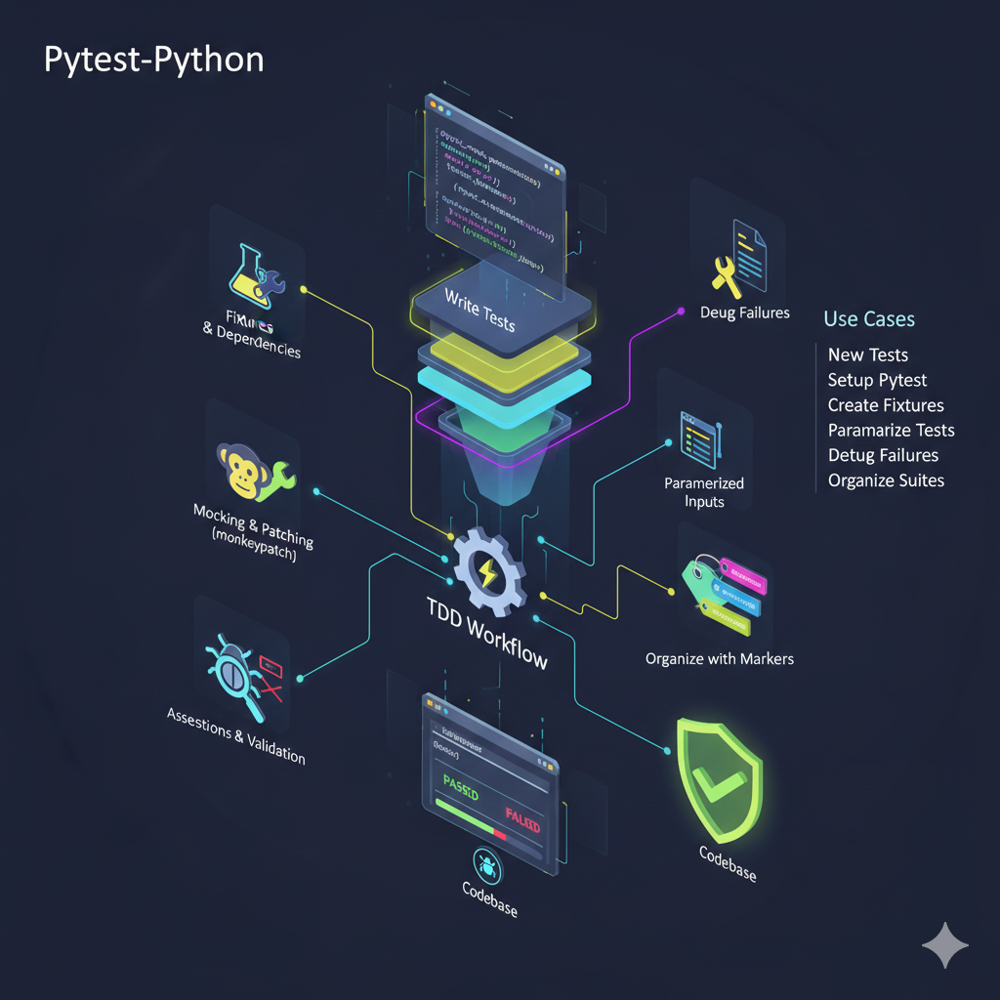

# Pytest-Python Skill 🧪

A comprehensive testing skill for **Claude Code** designed to automate the creation, management, and debugging of production-grade Python test suites using `pytest`.

---

## 📖 Overview

The `pytest-python` skill enables Claude to act as a specialized QA Engineer within your terminal. It streamlines the Test-Driven Development (TDD) workflow by providing deep integration with the `pytest` ecosystem, allowing for automated test generation, complex mocking, and rapid failure analysis.

## ✨ Key Features

* **Efficient Test Generation:** Quickly write maintainable tests for any Python code, following industry best practices.
* **Advanced Mocking:** Seamlessly handle external dependencies using `monkeypatch` and mocking/patching strategies.
* **Parametrization:** Create dry, efficient test suites by testing multiple inputs with a single test function.
* **Fixture Management:** Design and implement robust fixtures for complex test dependencies and setup/teardown logic.
* **Suite Organization:** Use custom markers and structured directories to keep your test suites organized and scalable.
* **Rapid Debugging:** Automated analysis of test failures to identify root causes and suggest immediate fixes.

## 🛠️ When to Use

This skill should be triggered when you need to:
1.  **Initialize** pytest in a new or existing Python project.
2.  **Write new test cases** for logic-heavy functions or classes.
3.  **Refactor tests** to use parametrization or shared fixtures.
4.  **Isolate tests** by mocking API calls, databases, or file systems.
5.  **Fix broken tests** during a CI/CD pipeline failure.

## 🚀 How to Use with Claude Code

### Step 1: Trigger the Skill
Ask Claude to perform a testing task using the skill name:
`claude "Using the pytest-python skill, write unit tests for the user authentication module with 100% coverage."`

### Step 2: Implementation
Claude will:
* Analyze your existing codebase.
* Identify edge cases and potential failure points.
* Generate a `tests/` directory (if not present) with structured test files.

### Step 3: Run & Debug
`claude "Run the pytest-python suite and debug any failures in the database connection tests."`

## 💡 Best Practices (Subagent Delegation)
* **Keep Tests Isolated:** Use subagents for heavy test exploration to avoid bloating the main session context.
* **Parallel Execution:** Launch multiple test agents simultaneously to save time, as work done by subagents does not consume the main session's context.
* **Synthesize Results:** Use the synthesis pattern to return only compact summaries of test results to the orchestrator, preventing auto-compaction.

---
*Created by [alijilani-dev] based on the Pytest-Python Skill definition and Subagent Delegation Strategy.*