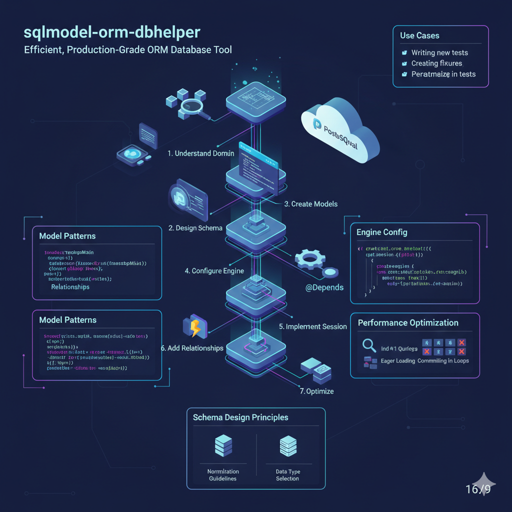

# SQLModel ORM Database Helper 🗄️

A comprehensive Claude Code skill for designing and implementing robust, high-performance database management layers using **SQLModel** and **SQLAlchemy 2.0** patterns.

---

## 📖 Overview

The `sqlmodel-orm-dbhelper` skill automates the creation of production-grade database schemas, models, and configurations for Python FastAPI projects. It ensures your database layer follows modern Python type hints and performance best practices, from connection pooling to relationship mapping.

## ✨ Key Features

* **Optimal Schema Design**: Automates the design of database schemas based on specific project domains.
* **SQLModel Generation**: Creates production-ready models with proper type annotations, constraints, and automatic timestamps.
* **Engine Configuration**: Configures SQLAlchemy engines with advanced connection pooling (QueuePool) and health checks.
* **FastAPI Integration**: Implements session management using context managers for clean dependency injection in FastAPI.
* **Performance Optimization**: Automatically applies indexing, lazy/eager loading strategies, and N+1 query prevention.
* **Modern Standards**: Adheres to SQLAlchemy 2.0 patterns and modern Python `Annotated` and `Optional` types.

## 🏗️ Workflow

The skill follows a structured 7-step pipeline to ensure high-quality delivery:
1. **Understand Domain** (identify entities and attributes).
2. **Design Schema** (normalize to 3NF).
3. **Create Models** (implement SQLModel classes and mixins).
4. **Configure Engine** (set up connection pooling).
5. **Implement Session** (create generators for FastAPI).
6. **Add Relationships** (define back_populates and cascades).
7. **Optimize** (configure indexes and loading strategies).

## 🚀 How to Use with Claude Code

### Step 1: Trigger the Skill
Provide your project context to activate the helper:
`claude "Using the sqlmodel-orm-dbhelper skill, design a database for an e-commerce app with Users, Orders, and Products."`

### Step 2: Provide Context
The skill will ask for clarifications regarding:
* Your project domain.
* Key entities required.
* Preferred database (SQLite, PostgreSQL, or MySQL).
* Performance priorities.

### Step 3: Deployment
Claude will generate:
* **models.py**: Clean, annotated SQLModel implementations.
* **database.py**: Production-ready engine and session setup.
* **Schema Design Doc**: Logic behind your tables and relationships.

## ⚠️ Anti-Patterns Avoided
* ❌ Session per operation (solves with one session per request).
* ❌ N+1 queries (solves with eager loading).
* ❌ Missing indexes (solves with index-frequent column filtering).
* ❌ Hardcoded credentials (solves with environment variables).

---
*Developed by [alijilani-dev] to streamline AI-Driven Database Development.*